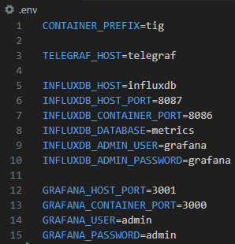

# IPoDWDM plug monitoring stack (Telegraf/InfluxDB/Grafana)
[Telegraf](https://www.influxdata.com/time-series-platform/telegraf/) is a plugin-driven server agent for collecting and reporting metrics.  
[InfluxDB](https://www.influxdata.com/time-series-platform/influxdb/) handle massive amounts of time-stamped information.  
[Grafana](https://grafana.com/) is an open platform for beautiful analytics and monitoring.  


## Requirements
As docker images, cTIG stack needs:

* docker v28.* at least
* docker-compose v2.36.* at least

To be installed on your machine.

## How to use it?
`.env` to the root directory exposes environment variables:



Modify it according to your needs and build your custom TIG stack:

```bash
$ docker compose up -d
```

### Known issues
* `docker compose` command fails for non-root user
    1. Create the `docker` group if not exists:

    ```bash
    $ sudo groupadd docker
    ``` 

    2. Add your user to the `docker` group:

    ```bash
    $ sudo usermod -aG docker $USER
    ```

    3. Reboot your machine

Then access grafana at `http://localhost:3001` (or replace the default port with your **GRAFANA_PORT**'s value).

